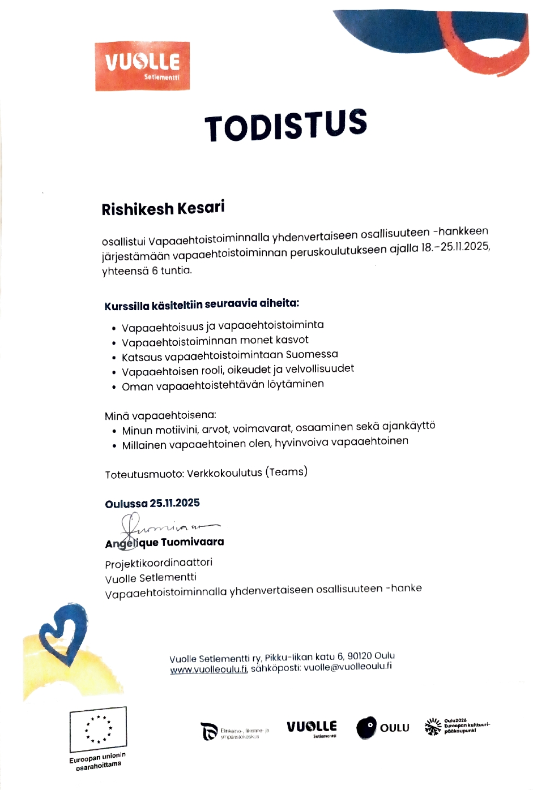

# Volunteering Experience – Rishi Kesari

This repository contains documentation related to my volunteering experience in Finland, focused on community engagement and support activities.

## Organization

* Vuolle Setlementti (Oulu, Finland)

## Focus Areas

* Community interaction and support
* Engagement with diverse groups and newcomers
* Participation in local activities and events

## Certificate

* Volunteering Certificate included in this repository
